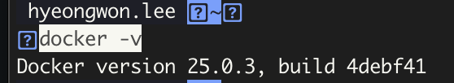
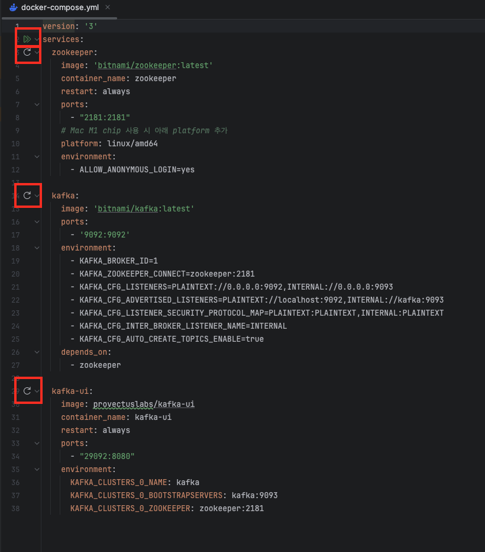
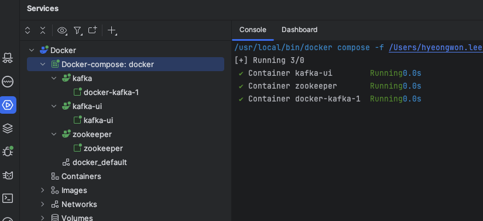
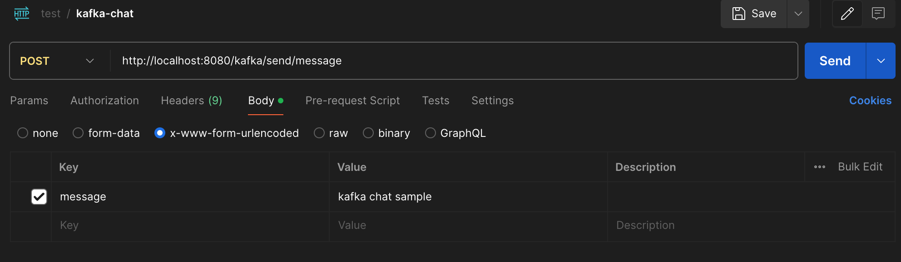
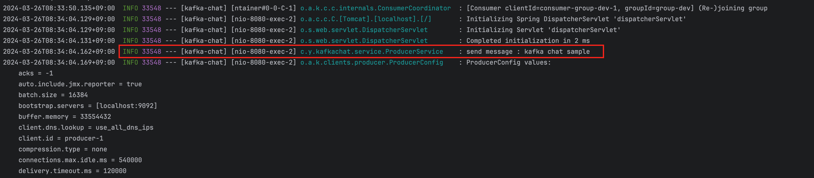
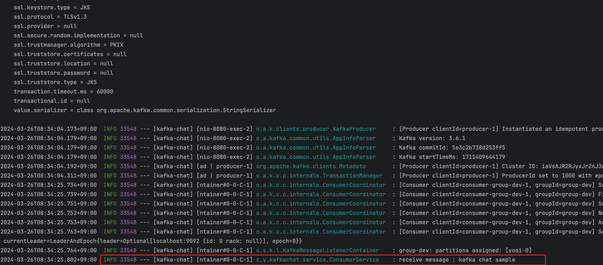
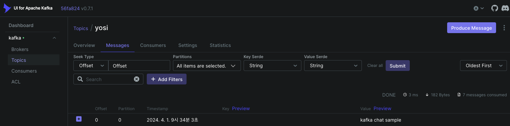

# kafka-chat
kafka sample application

- ## VER2.0 
- ### JDK 11

- ##### MacOS Docker 설치 
  - 다운로드 https://www.docker.com/products/docker-desktop/
  - 참고 https://goddaehee.tistory.com/312
  - 터미널에서 설치 확인 (docker -v)
    
  - docker desktop 실행

- #### docker-compose.yml (docker 실행 후 동작) 
  - 터미널 kafka-chat root /docker 경로에서 docker-compose 컨테이너 실행  
    docker-compose up -d (실행)  
    docker-compose down  (중지)
 
  - 또는 docker-compose.yml 에서도 순차적으로 실행 또는 한번에 가능 위와 같음
  
  - 정상 실행 확인
  

- #### API 호출 http://localhost:8080/kafka/send/message
  - ChatController broadcastGroupMessage -> KafkaTemplate Topic 생성 및 메시지 전달
  - 

- ### log 확인

- #### Kafka-ui 확인 http://localhost:29002
  - 토픽 및 메시지 기록 확인
  

### etc

- #### 토픽 목록 조회
  - kafka-topics --bootstrap-server localhost:9092 --list
- #### 토픽 생성
  - kafka-topics --bootstrap-server localhost:9092 --partitions 1 --create --topic {토픽명}
- #### 파티션 수 증가
  - kafka-topics --bootstrap-server [YOUR_BOOTSTRAP_SERVER] --alter --topic [YOUR_TOPIC_NAME] --partitions [NEW_PARTITION_COUNT]

